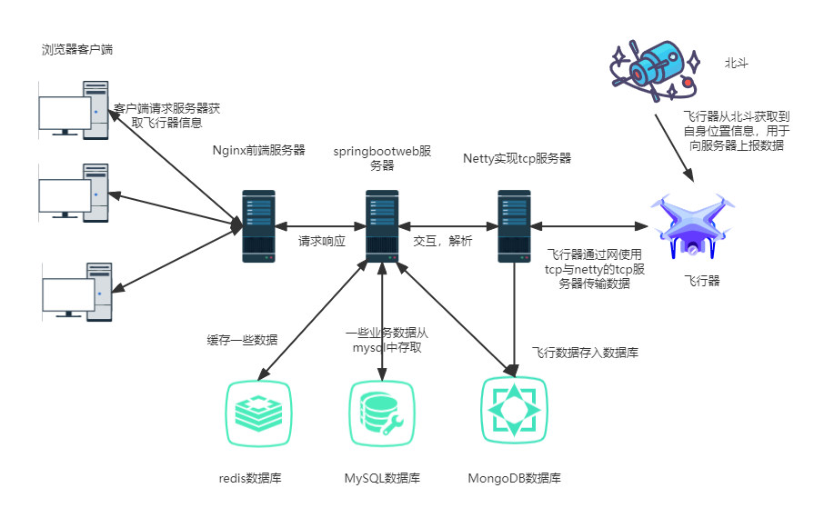
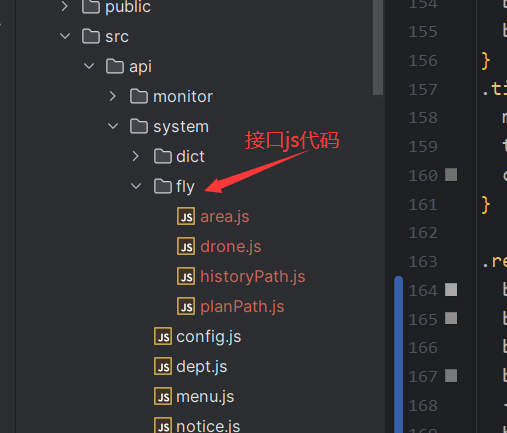
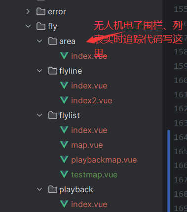
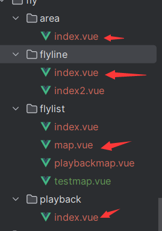
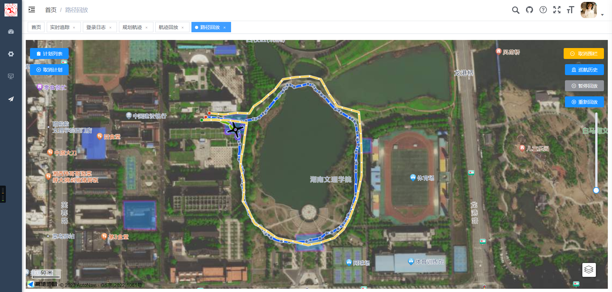

该项目源自https://github.com/zozikng/Fly
已对其进行二次开发。

# 无人机飞行管控平台

## 1.模块介绍

​	本项目分为三个模块，前端fly-ui，后端Fly，无人机客户端client，

项目的主要架构如图所示：



项目的主要功能结构图如下：


## 2.项目代码目录介绍

### 2.1后端代码目录结构


### 2.2前端代码





## 3.项目部署

### 3.1后端部署

本项目需要使用到三个数据库，Redis，mysql，MongoDB数据库，安装好数据库后，项目下下来修改配置文件中的mysql，redis，MongoDB数据的地址和密码即可：


### 3.2前端部署

拿到项目后将自己的key填到这几个代码文件的key中，key的申请可以去高德地图中自行获取。




### 3.3客户端连接

​	将模拟无人机客户端的ip改为服务器对应的ip，即可连接服务器。

要想自定义模拟飞行路线的话，可以修改bmhFlyData.txt文件中的数据。

- 数据格式说明：

```java
800802170200100
145811
1  111.670269  29.049301
```

第一行是无人机id，第二行是北斗卡号，与网站上自己添加的无人机id和卡号相同才能对应无人机。

第三行以后是飞行的路径，以一下格式输入即可

```java
序号空格空格经度空格空格纬度
```

## 4.服务器docker部署

### 4.1 安装好docker

教程见网络

### 4.2 安装MongoDB

```shell
#拉取镜像
docker pull mongo:4.0.3

mkdir -p /home/zzk/mongo/{data,conf,backup}

docker run --name=mongodb -v /home/zzk/mongo/data:/data/db \
-v /home/zzk/mongo/backup:/data/backup \
-v /home/zzk/mongo/conf:/data/configdb \
--restart=on-failure:3 \
-p 27017:27017 -d mongo:4.0.3 --auth


docker exec -it mongodb mongo admin

db.createUser({user:'root',pwd:'aokaizzk',roles:[{role:'root',db:'admin'}],})

db.auth('root','aokaizzk')
```

### 4.3安装MySQL

```shell
docker pull mysql:8.0.19

docker run --name mysql -v /home/zzk/mysql:/var/lib/mysql -p 3306:3306 -e MYSQL_ROOT_PASSWORD=aokaizzk -d mysql:8.0.19
```

### 4.4安装redis

见网上教程

### 4.5构造镜像包

dockerflie文件：

```shell

#基础镜像使用jdk1.8
FROM openjdk:8
 
#作者
MAINTAINER zzk
 
# VOLUME 指定临时文件目录为/tmp，在主机/var/lib/docker目录下创建了一个临时文件并链接到容器的/tmp
VOLUME /tmp
 
# 将jar包添加到容器中并更名
ADD fly-admin.jar app.jar
 
# 运行jar包
RUN bash -c 'touch /app.jar'
 
# 为了缩短 Tomcat 启动时间，添加一个系统属性指向 “/dev/./urandom” 作为 Entropy Source
ENTRYPOINT ["java","-Djava.security.egd=file:/dev/./urandom","-jar","/app.jar"]
 
#ENTRYPOINT ["nohup","java","-jar","/data/cat/fly-admin.jar","&"]
 
#暴露8080 8888端口
EXPOSE 8080
EXPOSE 8888

docker build -t fly:1.0 .

docker run -d --name fly -p 8080:8080  -p 8888:8888 fly:1.0
```

### 4.6部署前端nginx

```shell

#是部署nginx
#需要一个conf文件存放目录，和html文件目录,及日志存放目录
mkdir -p /home/zzk/nginx/{conf,html,logs}

docker run --name nginx -p 80:80 -d nginx:1.18.0
# 复制配置
docker cp nginx:/etc/nginx/nginx.conf /home/zzk/nginx/conf/nginx.conf
docker cp nginx:/etc/nginx/conf.d /home/zzk/nginx/conf/conf.d
docker cp nginx:/usr/share/nginx/html /home/zzk/nginx/html
 
#先用 [docker ps – a] 命令 找到对应容器ID
#才可以删除容器
docker rm -f [容器ID]


docker run -d \
-p 80:80 \
-p 443:443 \
--name nginx \
--restart=always \
--network-alias nginx \
-e TZ="Asia/Shanghai" \
-v /home/zzk/nginx/conf/nginx.conf:/etc/nginx/nginx.conf \
-v /home/zzk/nginx/conf/conf.d:/etc/nginx/conf.d \
-v /home/zzk/nginx/logs/nginx:/var/log/nginx \
-v /home/zzk/nginx/html:/usr/share/nginx/html \
-v /home/zzk/nginx/cert:/etc/nginx/cert \
nginx:1.18.0
```

配置文件

```shell
#user  nobody;
worker_processes  1;

#error_log  logs/error.log;
#error_log  logs/error.log  notice;
#error_log  logs/error.log  info;

#pid        logs/nginx.pid;


events {
    worker_connections  1024;
}

http {
    include       mime.types;
    default_type  application/octet-stream;
    sendfile        on;
    keepalive_timeout  65;

    server {
        listen       80;
        server_name  zozikng.top;
		charset utf-8;

		location / {
            root   /usr/share/nginx/html/dist;
			try_files $uri $uri/ /index.html;
            index  index.html index.htm;
        }

		location /prod-api/ {
			proxy_set_header Host $http_host;
			proxy_set_header X-Real-IP $remote_addr;
			proxy_set_header REMOTE-HOST $remote_addr;
			proxy_set_header X-Forwarded-For $proxy_add_x_forwarded_for;
			proxy_pass http://10.0.12.9:8080/;
		}

		location /dev-api/ {
        			proxy_set_header Host $http_host;
        			proxy_set_header X-Real-IP $remote_addr;
        			proxy_set_header REMOTE-HOST $remote_addr;
        			proxy_set_header X-Forwarded-For $proxy_add_x_forwarded_for;
        			proxy_pass http://10.0.12.9:8080/;
        		}

        error_page   500 502 503 504  /50x.html;
        location = /50x.html {
            root   /usr/share/nginx/html/dist;
        }
    }


    # another virtual host using mix of IP-, name-, and port-based configuration
    #
    #server {
    #    listen       8000;
    #    listen       somename:8080;
    #    server_name  somename  alias  another.alias;

    #    location / {
    #        root   html;
    #        index  index.html index.htm;
    #    }
    #}


    # HTTPS server
    #
    #server {
    #    listen       443 ssl;
    #    server_name  localhost;

    #    ssl_certificate      cert.pem;
    #    ssl_certificate_key  cert.key;

    #    ssl_session_cache    shared:SSL:1m;
    #    ssl_session_timeout  5m;

    #    ssl_ciphers  HIGH:!aNULL:!MD5;
    #    ssl_prefer_server_ciphers  on;

    #    location / {
    #        root   html;
    #        index  index.html index.htm;
    #    }
    #}

}
```

## 实现效果


